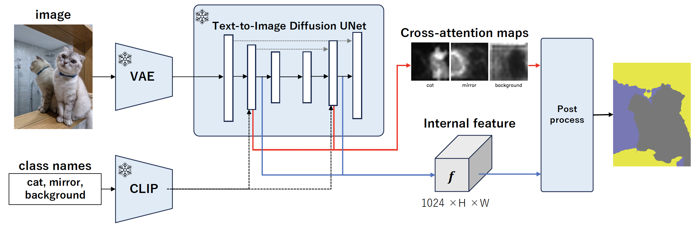
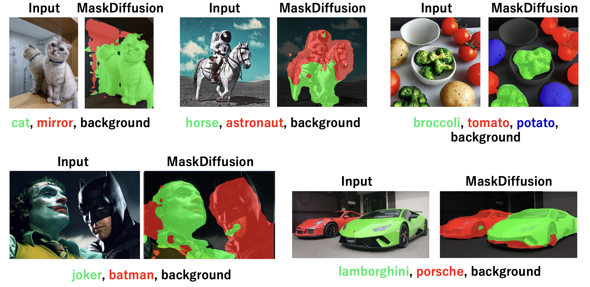

# MaskDiffusion: Exploiting Pre-trained Diffusion Models for Semantic Segmentation
This repo is the official implementation of "MaskDiffusion: Exploiting Pre-trained Diffusion Models for Semantic Segmentation".

MaskDiffusion is an innovative approach to open-vocabulary semantic segmentation that utilizes pretrained frozen
Stable Diffusion models. It overcomes the challenges of traditional semantic segmentation methods by not requiring
additional training or annotation. MaskDiffusion significantly enhances performance over similar methods and excels
in handling open vocabularies, including detailed and specific categories like fine-grained and proper nouns.
Demonstrating substantial improvements in both qualitative and quantitative metrics against comparable unsupervised
segmentation approaches, MaskDiffusion sets a new benchmark, as evidenced by its performance on datasets like Potsdam
and COCO-Stuff. The approach promises to advance the field of computer vision by making semantic segmentation more
accessible and versatile.



Our results highlight the successful segmentation of challenging concepts such as 'mirror' in (a) and rare segmentation
tasks such as 'astronaut' in (b). Additionally, the model demonstrates the capability to identify general classes, as
depicted in (c), indicating that its segmentation performance improves with more general classes. Impressively, the
segmentation of proper nouns is also achievable, as evidenced in results (d) and (e).



## Installation

Install with Docker.

```sh
make build
```

To install docker to your environment, please refer to [this repository](https://github.com/Valkyrja3607/docker-template).

## Dataset

Please set DATASET_DIR variable in Makefile to directory your dataset is containing.
The following structure is assumed.

```sh
── datasets
   ├── cityscapes
   ├── cocostuff
   └── VOCdevkit
```

## Run

To run MaskDiffusion code, please run like below.

```sh
make run
```

To enter docker container, please run like below.

```sh
make bash
```

## Result

Result will be contained under outputs directory.
